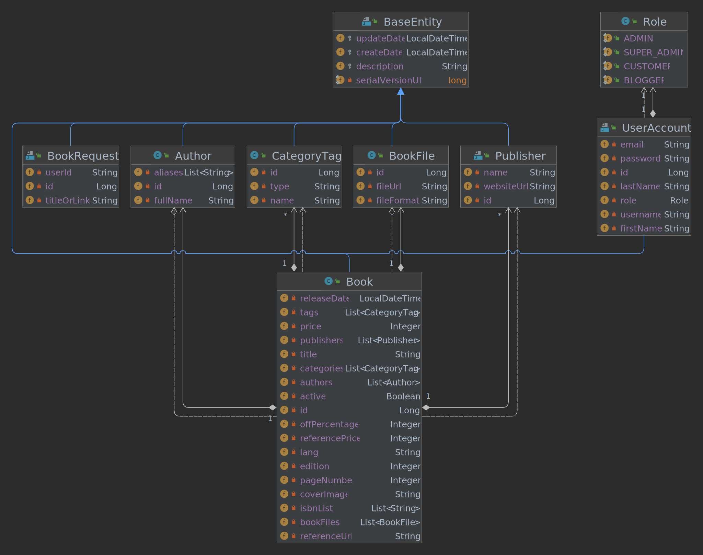

# Book Store API (Java 17, Spring Boot 3)

### Overview
This project is the abbreviated version of the book store project. Various features are supported in this project. It should be noted that the full version of this project is in operation, and you can request a demo via `admin@javagym.ir` email. 
In the picture below, you can see the class diagram of this abbreviated project.

To try out this app, you need to use Eclipse or Intellij IDEA. You can clone this repository or download it via [This](https://github.com/gymofjava/book-store/archive/refs/heads/main.zip) link.

### Tools & Technologies
* [Java] - Programming Language
* [Spring, Spring Boot, etc] - Back-end Framework
* [maven] - Build Tool
* [Git] - Version control
* [PostgreSQL] - Database
